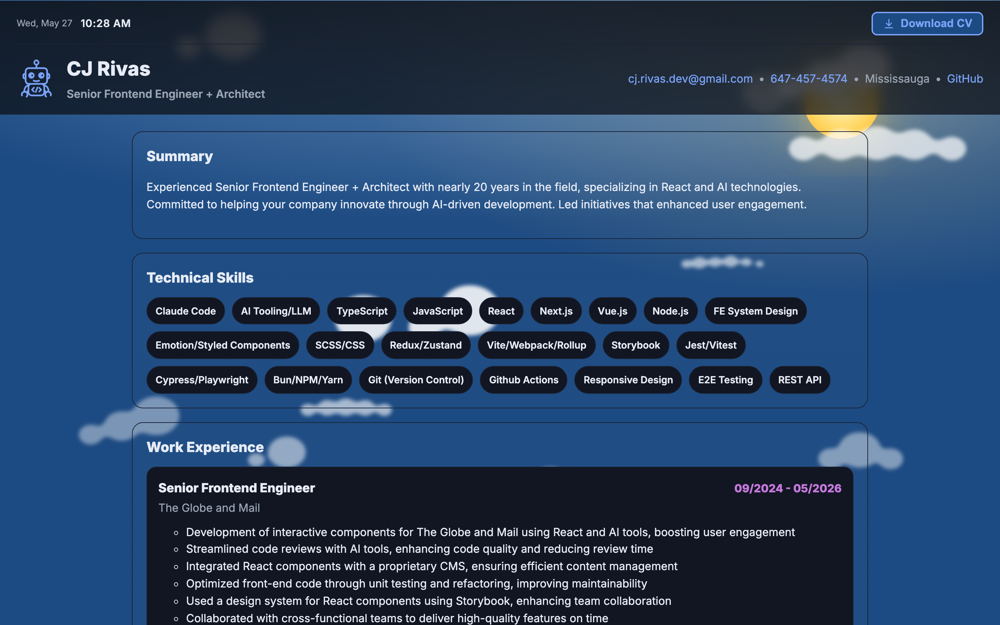
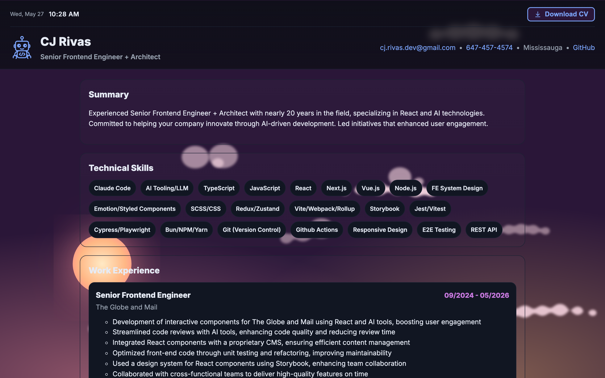
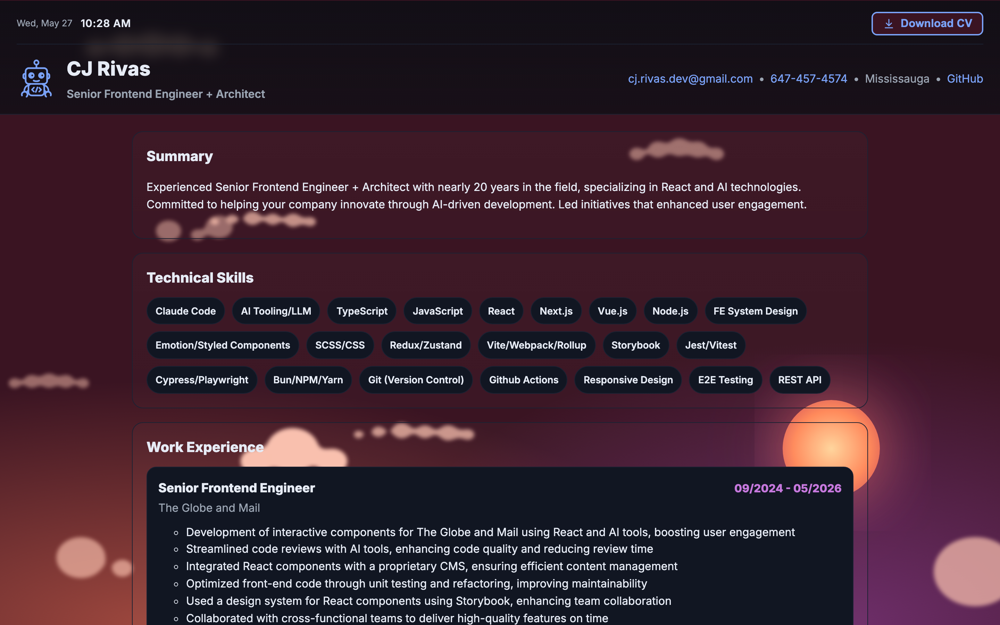
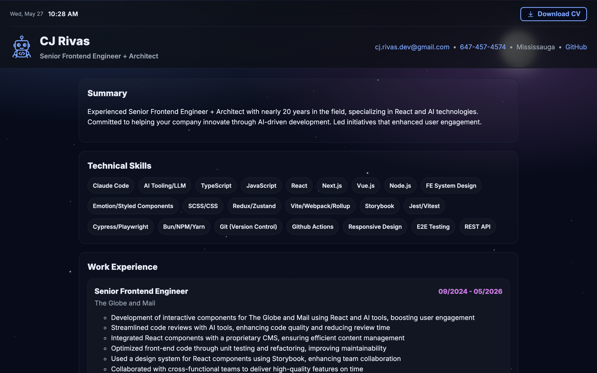
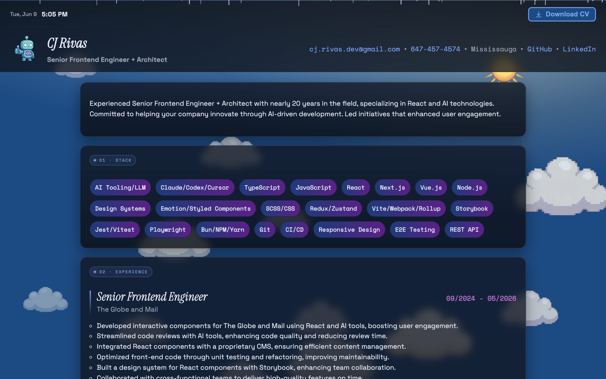
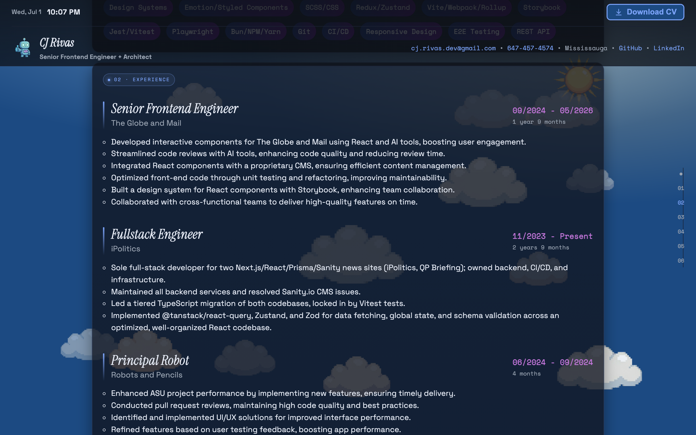
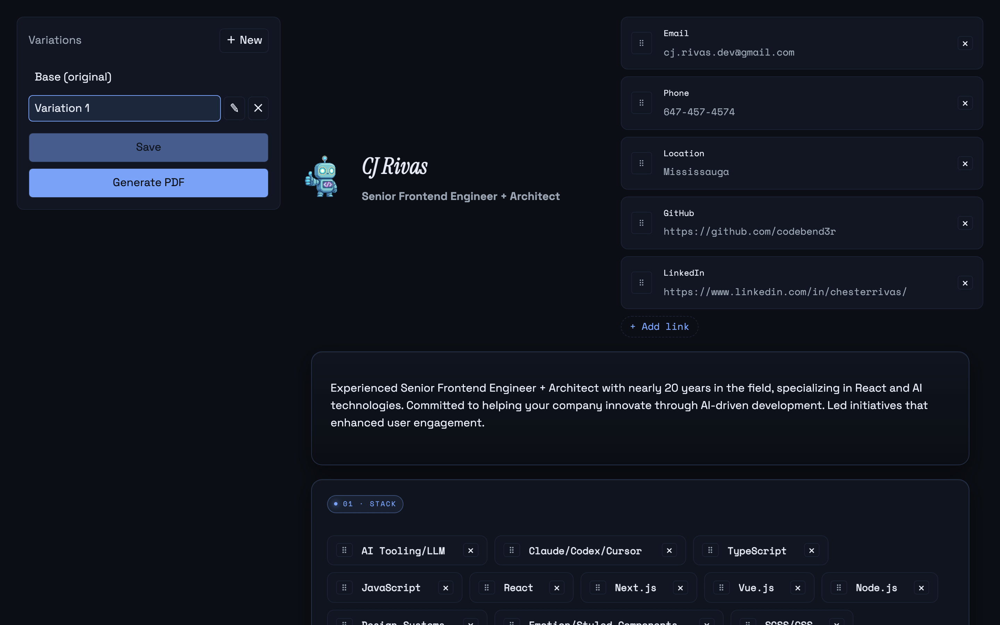

# CJ Rivas — Portfolio

> A single-page resume & portfolio for a Senior Frontend Engineer + Architect. Built as a showcase of modern React patterns, with a living, time-of-day sky, a live weather overlay driven by the visitor's location, native PDF and Word export, a full drag-and-drop resume editor with saved variations, and a flow that tailors the resume to a job posting.



---

## Features

### Time-of-day sky

The background ambient palette changes based on the visitor's local hour. Four distinct stages, each with hand-tuned palettes, glows, sun position, and cloud tint:

|               Dawn (5–8)               |              Day (8–17)               |              Dusk (17–20)              |               Night (20–5)               |
| :------------------------------------: | :-----------------------------------: | :------------------------------------: | :--------------------------------------: |
|  |  |  |  |

- 9 cloud shapes pulled from a single 3×3 PNG sprite sheet (`src/assets/clouds.png`), randomized across two parallax layers.
- Each cloud has an independent drift animation (`@keyframes cloudDrift`) and reacts to page scroll via `requestAnimationFrame` for buttery parallax.
- The sun and moon come from their own 3×3 sprite sheets (`src/assets/sun.png`, `src/assets/moon.png`), with a different sun cell and position per sky.
- Night swaps the clouds layer for a three-layer parallax `<Starfield />` (160 + 80 + 30 stars, each layer scrolling at a different speed) and a soft glowing moon.

Force a state with `?sky=day|dawn|dusk|night` — handy for screenshots and demos.

### Live weather overlay

On load, the app requests the visitor's geolocation and queries [Open-Meteo](https://open-meteo.com) for the current weather code. Two of the WMO code families trigger an overlay:

|                        Rain                        |                        Snow                        |
| :------------------------------------------------: | :------------------------------------------------: |
|  |  |

- 140 raindrops / 90 snowflakes, each with randomized position, size, opacity, and animation duration so no two frames look the same.
- All particles are pure CSS animations (`rainFall`, `snowFall`) — no canvas, no JS frame loop, no jank.
- Override with `?weather=rain|snow|none` to preview without waiting on geolocation.

### Sticky weather + clock indicator

A live indicator shows the current local date, time, weather emoji, and temperature — pinned in the header.



- The `AppHeader` bar is `position: sticky`. A CSS scroll-driven animation (`animation-timeline: scroll(root)`) shrinks it into a compact layout (smaller logo and title, tighter padding) between 100px and 150px of scroll, with no JS. Narrow viewports, `prefers-reduced-motion`, and browsers without scroll-driven animations keep the full-size header.
- Clock ticks once per minute via `setInterval`; weather is fetched once on page load, not polled.

### Section navigation

A floating nav tracks scroll position via `IntersectionObserver` and highlights the section currently in view, with numbered chips mirroring the sections mounted in `App.tsx`. Clicking a link smooth-scrolls to the section (instant if `prefers-reduced-motion` is set).

### Light / Dark / Auto theme

A segmented control in the header switches between light, dark, and auto themes. Auto follows the sky: light during day and dawn, dark at dusk and night. The choice persists to `localStorage`, `?theme=light|dark|auto` overrides it for stable screenshots, and every color token in `src/styles/tokens.css` is defined per theme under `data-theme` on `<html>`.

### Career map

A three-lane Gantt chart at the top of Work Experience plots every stint as a bar on a shared year axis — full-time and part-time employment above the always-running Codebender Inc. side-project track. Bars, ranges, and ticks are computed from the `period` strings in `resume.json` (`src/utils/careerMap.ts`).

### Recruiter chat

A Claude-powered chatbot (`/api/chat`) answers questions from recruiters about CJ's work history, experience, stack, and in particular the date overlaps that can read as a red flag on a skim. The chat answers only from the resume and owner-authored notes, never invents facts, and hands visitors off to CJ for anything it cannot answer. Answers include source chips that scroll to the cited role on the page and timeline figures visualizing overlaps. Enabled with `VITE_CHAT_ENABLED=true`; the server-side salt for visitor IP hashing is `CHAT_HASH_SALT`. Daily usage is capped per visitor and globally to bound spend.

### Codebender Inc. + Selected Client Work

The showcase splits by one rule — entries with a `repo` are side projects, entries without are client engagements. Side projects render in an amber-tinted Codebender Inc. section (practice intro, four "how it works" pillars, project cards with Live/Code links); client work renders as a grid of flat image-led cards (screenshot, role, period, description). Both source from the `showcase` array in `resume.json`.

### One-click PDF and Word export

The header's **PDF CV** and **Word CV** buttons build the resume entirely client-side. Both generators are dynamically imported, so they never ship in the main bundle; only users who download (or export from the editor) pay for those chunks.

- **PDF** uses [`@react-pdf/renderer`](https://react-pdf.org). `src/pdf/ResumePDF.tsx` mirrors the on-page layout using the print token source `src/theme/tokens.ts`, and `src/pdf/fonts.ts` embeds Source Serif 4 and Source Sans 3 (from `@fontsource`) via `Font.register`. The renderer and its `fontkit` dependency load through `import("@pdf")`.
- **Word** uses [`docx`](https://docx.js.org). `src/docx/ResumeDocx.ts` builds the document with Source Serif 4 and Source Sans 3 TTFs embedded from `src/docx/fonts/`, loaded through `import("@docx")`.
- Filenames come from `documentFileName()`: `<name> - <title>.pdf` (or `.docx`).

### Resume editor & variations



Visiting `/edit-resume` (or `/edit-resume/:id` for a specific variation) mounts the same component tree in an editing context (`EditProvider`) instead of the read-only page. When Supabase is configured, the route sits behind `AuthGate` and the owner signs in at `/login`:

- Every text field becomes an inline, auto-growing `<input>`/`<textarea>` (`EditableText`) that writes straight to the Zustand store via a generic `setPath(path, value)`.
- Lists (contact entries, skills, work history, showcase items and their tags, awards, languages, education) get add/remove buttons and drag-to-reorder handles powered by `@dnd-kit`. The drag machinery is lazy-loaded (`SortableListImpl`) so the public-facing page never downloads it.
- A **Variations** side panel lets you fork the base resume into named, independently-editable copies persisted to `localStorage` (Zustand `persist` middleware, `src/state/useVariations.ts`) and, when signed in, synced to a Supabase `resume_variations` table (`src/state/useSync.ts`). Switch between "Base (original)" and any saved variation, rename or delete variations, and an unsaved-changes guard (`beforeunload`) warns before you navigate away with a dirty edit.
- **Generate PDF** and **Generate Word** export whichever variation is active, named `<name> - <variation name>` (e.g. `CJ Rivas - Backend Leaning.pdf`).
- A JSON editor (`JsonEditor`) edits the active resume as raw JSON, validated on apply.

### Tailored variations from a job posting

`/generate-proximate` and `/generate-exact` (owner-only, behind `AuthGate`) take a pasted job posting (text, link, or screenshot) and ask Claude to tailor the base resume into a new variation; the base resume is never modified. Proximate mode stays close to the real history, while exact mode rewrites to cover every requirement. The preview highlights every line that differs from the base resume (`DiffContext`) so each change can be reviewed before saving. Generation runs in a Netlify background function (`netlify/functions/generate.mts`) that the client polls through `generate-status`.

### Data-driven content

The entire resume — name, contact, summary, skills (+ per-skill hover text), work history, awards, languages, education, showcase — is hydrated from a single `src/data/resume.json` file at module load and normalized through `normalizeData()` (which migrates older/legacy data shapes, e.g. a pre-array `contact` object, so saved variations never break after a schema change). Adding a new section is: extend the JSON → add a type → extend the Zustand store → mount a component.

Hover tooltips on each Technical Skills pill come from the `skill_descriptions` array in `resume.json`, kept in parallel with `technical_skills` (and reordered/edited together in the editor).

Each work experience entry also shows a computed, human-readable duration (e.g. "1 year 9 months") derived from its `period` string by `src/utils/experienceDuration.ts`.

---

## Full page

<details>
<summary>Click to expand a full-page screenshot</summary>


</details>

---

## Tech stack

| Layer               | Choice                                            | Why                                                                                                                                         |
| ------------------- | ------------------------------------------------- | ------------------------------------------------------------------------------------------------------------------------------------------- |
| **Build / dev**     | Vite 8                                            | Instant HMR, native ESM, fast cold starts                                                                                                   |
| **UI framework**    | React 19 + TypeScript 6                           | `useId`, automatic batching, modern types                                                                                                   |
| **State**           | Zustand 5                                         | Tiny, no boilerplate; resume store seeded from JSON, variations store persisted to `localStorage`                                           |
| **Styling**         | CSS Modules + design tokens                       | Scoped class names, no runtime, readable in DevTools (`Header_logo__a3f2`)                                                                  |
| **PDF export**      | `@react-pdf/renderer`                             | Declarative React → PDF, embedded webfonts, runs entirely client-side, lazy-loaded chunk                                                    |
| **Word export**     | `docx`                                            | Builds `.docx` client-side with embedded fonts, lazy-loaded chunk                                                                           |
| **Drag & drop**     | `@dnd-kit/core` + `sortable` + `utilities`        | Accessible reordering in the resume editor; lazy-loaded, absent from the public page                                                        |
| **Webfonts**        | Google Fonts + `@fontsource`                      | Instrument Serif, Geist, and Geist Mono on the page (`index.html`); Source Serif 4 and Source Sans 3 files embedded in PDF and Word exports |
| **Weather data**    | Open-Meteo (free, no key)                         | WMO weather codes via `current_weather`                                                                                                     |
| **Testing**         | Vitest 5 + Testing Library + jsdom                | Component + util tests colocated next to source                                                                                             |
| **Lint**            | Oxlint (Rust)                                     | `.oxlintrc.json`; replaces ESLint, `typescript-eslint`, `react`, `react-hooks`, `jsx-a11y`                                                  |
| **Format**          | Oxfmt (Rust)                                      | `.oxfmtrc.json`; formats JS/TS/JSON/YAML/Markdown/CSS and sorts imports; replaces Prettier                                                  |
| **CSS lint**        | Gale (Stylelint-compatible, Rust)                 | `.stylelintrc.json`; extends `stylelint-config-standard` over `src/**/*.css`                                                                |
| **Type checking**   | `tsgo --noEmit` (`@typescript/native-preview`)    | Go port of `tsc`; runs on every commit                                                                                                      |
| **Git hooks**       | Lefthook + lint-staged                            | `lefthook.yml` + `lint-staged.config.ts`; `pre-commit`: lint-staged (fix, format, spellcheck staged files) → typecheck → test               |
| **Package manager** | Bun                                               | `packageManager` field pinned in `package.json`                                                                                             |
| **Auth + sync**     | Supabase                                          | Owner sign-in gates the editor and generate routes; variations sync to a `resume_variations` table                                          |
| **AI tailoring**    | Claude (`@anthropic-ai/sdk`) on Netlify Functions | Background function turns a job posting into a tailored resume variation                                                                    |
| **Deploy**          | Netlify                                           | Project: [`codebender-portfolio`](https://app.netlify.com/projects/codebender-portfolio)                                                    |

---

## Architecture

```
src/
├── Entry.tsx                ← React root; mounts <SideMenu /> plus the page for the current route
├── pageForRoute.tsx         ← Route → page map (paths parsed by utils/routeFor.ts); private pages wrap in <AuthGate />
├── App.tsx                  ← Public page: Sky + Weather + SectionNav + AppHeader + read-only sections
├── components/              ← Flat directory; components pair a .tsx with a .module.css (+ .test.tsx)
│   ├── AppHeader.tsx        ← Sticky bar; mounts <WeatherClock /> + <ThemeToggle /> + PDF/Word download buttons + <Header />
│   ├── Header.tsx           ← Identity + contact line (email, phone, location, GitHub, LinkedIn)
│   ├── SectionNav.tsx       ← Floating nav; highlights active section via IntersectionObserver
│   ├── CareerMap.tsx        ← Three-lane Gantt of the career computed from `period` strings
│   ├── Codebender.tsx       ← Amber side-project section: pillars + project cards (repo-carrying showcase entries)
│   ├── ThemeToggle.tsx      ← Light/Dark/Auto segmented control persisted via `useTheme`
│   ├── Sky.tsx              ← Time-of-day clouds, sun, moon (PNG sprites); swaps to <Starfield /> at night
│   ├── Starfield.tsx        ← Parallax 3-layer night sky (160 + 80 + 30 stars)
│   ├── Weather.tsx          ← Rain (140 drops) / snow (90 flakes) overlay; pure CSS animation
│   ├── WeatherClock.tsx     ← Live clock + weather emoji + temperature (ticks every minute)
│   ├── Section.tsx          ← Shared <section> + <h2> wrapper used by all content sections
│   ├── SideMenu.tsx         ← Owner navigation drawer; renders only when signed in
│   ├── AuthGate.tsx         ← Redirects anonymous visitors away from private routes
│   ├── LoginPage.tsx        ← Owner sign-in form at /login
│   ├── DiffContext.tsx      ← Lets sections flag lines that differ from the base resume (generate preview)
│   ├── Summary.tsx  TechnicalSkills.tsx  SoftSkills.tsx  WorkExperience.tsx  Showcase.tsx
│   └── Awards.tsx  Languages.tsx  Education.tsx  Footer.tsx
├── edit/                    ← Resume editor, mounted at /edit-resume
│   ├── EditResumeApp.tsx    ← Renders the resume tree inside EditProvider; owns variation/session state
│   ├── EditContext.tsx      ← `EditProvider` + `useEditing()`: editing flag and `markDirty()`
│   ├── EditableText.tsx     ← Inline auto-growing input/textarea bound to a store path
│   ├── EditableSelect.tsx   ← <select> bound to a store path
│   ├── JsonEditor.tsx       ← Raw JSON view of the active resume, validated before applying
│   ├── VariationsPanel.tsx  ← Create/rename/delete/select/sync variations; Save + Generate PDF/Word actions
│   ├── RenameModal.tsx      ← Portal-rendered modal for naming/renaming a variation
│   ├── useVariationRoute.ts ← Keeps /edit-resume/:id and the selected variation in step
│   ├── SortableList.tsx     ← Public wrapper; lazy-loads dnd-kit only when editing
│   ├── SortableListImpl.tsx ← Actual @dnd-kit sortable context (lazy chunk)
│   └── sortableContext.ts   ← Context bridging the lazy dnd-kit implementation into SortableItem
├── generate/                ← Job posting → tailored variation, at /generate-proximate and /generate-exact
│   ├── GenerateApp.tsx      ← Page shell: posting input, then a preview of the result
│   ├── DropArea.tsx         ← Accepts pasted text, a link, or a screenshot
│   ├── GeneratePreview.tsx  ← Renders the generated resume inside a DiffProvider
│   └── useGenerate.ts       ← Starts the background job and polls /generate-status
├── pdf/                     ← @react-pdf/renderer document, lazy-loaded via `import("@pdf")`
│   ├── generatePdf.tsx      ← generateResumePdf(data) → Blob
│   ├── ResumePDF.tsx        ← React-PDF document mirroring the on-page resume layout
│   ├── fonts.ts             ← Registers Source Serif 4 + Source Sans 3 for @react-pdf/renderer
│   ├── styles.ts            ← @react-pdf/renderer StyleSheet definitions
│   └── index.ts             ← Barrel: generateResumePdf + downloadBlob
├── docx/                    ← Word export via `docx`, lazy-loaded via `import("@docx")`
│   ├── generateDocx.ts      ← generateResumeDocx(data) → Blob
│   ├── ResumeDocx.ts        ← Builds the Word document from resume data
│   ├── fonts.ts  assets.ts  ← Load the embedded TTFs (fonts/) and the logo
│   └── index.ts             ← Barrel: generateResumeDocx + downloadBlob
├── theme/tokens.ts          ← Print/export design tokens (colors, fonts, spacing) shared by PDF and Word
├── data/
│   ├── resume.json          ← Single source of truth for resume content (incl. showcase, skill_descriptions)
│   ├── resumeData.ts        ← Typed view of resume.json; guards narrow string fields to literal unions
│   └── codebender.ts        ← Screen copy + pillars for the Codebender Inc. section
├── state/
│   ├── useStore.ts          ← Zustand store seeded from resumeData; setPath/reorder + add/remove actions
│   ├── useVariations.ts     ← Zustand store (persisted to localStorage) for named resume variations
│   ├── useSync.ts           ← Syncs variations with the Supabase `resume_variations` table
│   ├── supabase.ts          ← Supabase client; null when the env vars are absent
│   ├── useAuth.ts           ← Supabase session state
│   └── useTheme.ts          ← Light/Dark/Auto choice
├── styles/
│   ├── tokens.css           ← :root CSS custom properties, redefined per theme under data-theme
│   ├── keyframes.css        ← cloudDrift, rainFall, snowFall, sunGlowPulse, glowPulse
│   └── global.css           ← resets + @media print rules
├── sky.ts                   ← getCurrentSky(), applySky() (theme-aware palettes), URL override parsing
├── weather.ts               ← Open-Meteo fetcher, WMO code mapping, URL override parsing
├── utils/                   ← Pure helpers (routeFor, setPath, normalizeData, experienceDuration, careerMap, documentFileName, …)
├── types/                   ← global.d.ts (ambient resume types) + database.types.ts (generated Supabase types)
└── test/                    ← Vitest setup + shared resume fixture
```

### Path aliases

Configured in **both** `vite.config.ts` (runtime) and `tsconfig.json` (types) — they must stay in sync.

`@App`, `@app/*`, `@assets/*`, `@chat` / `@chat/*`, `@components/*`, `@data/*`, `@docx` / `@docx/*`, `@edit/*`, `@generate/*`, `@pdf` / `@pdf/*`, `@sky`, `@state/*`, `@styles/*`, `@theme/*`, `@utils/*`, `@weather`

---

## Getting started

Requires Node 26 (see `.nvmrc`) and the Bun version pinned in `package.json`.

```bash
bun install
bun dev          # http://localhost:4242
```

The public page needs no configuration. Copy `.env.example` to `.env` to turn on the cloud features: `VITE_SUPABASE_URL` and `VITE_SUPABASE_ANON_KEY` enable owner sign-in and variation sync (without them the editor is open and local-only), and `ANTHROPIC_API_KEY` and `GENERATE_PASSWORD` power the generate functions under `netlify dev`.

### Demo URLs

| URL                                             | Effect                                                                |
| ----------------------------------------------- | --------------------------------------------------------------------- |
| `http://localhost:4242/?sky=night`              | Force night sky + starfield                                           |
| `http://localhost:4242/?sky=dawn`               | Force dawn palette                                                    |
| `http://localhost:4242/?weather=rain`           | Force rain overlay                                                    |
| `http://localhost:4242/?weather=snow`           | Force snow overlay                                                    |
| `http://localhost:4242/?sky=night&weather=snow` | Combine: snowy night                                                  |
| `http://localhost:4242/edit-resume`             | Open the resume editor (sign-in required when Supabase is configured) |

---

## Scripts

| Script                                                  | What it does                                                                                                                      |
| ------------------------------------------------------- | --------------------------------------------------------------------------------------------------------------------------------- |
| `bun dev`                                               | Vite dev server on port `4242`                                                                                                    |
| `bun run build`                                         | Production build (note: `bun build` invokes Bun's bundler, so always use `bun run build`)                                         |
| `bun preview`                                           | Preview the built output                                                                                                          |
| `bun lint`                                              | `lint:ts` → `lint:css` → `lint:actions`                                                                                           |
| `bun lint:ts` / `bun lint:ts:fix`                       | Oxlint (`.oxlintrc.json`); type-aware rules are configured but not run (see Toolchain)                                            |
| `bun lint:css` / `bun lint:css:fix`                     | Gale (Stylelint-compatible) over `src/**/*.css`                                                                                   |
| `bun lint:actions`                                      | actionlint over `.github/workflows`                                                                                               |
| `bun spellcheck` / `bun spellcheck:fix`                 | typos over the whole repo; scope and allowlist in `_typos.toml`                                                                   |
| `bun format:staged`                                     | lint-staged (`lint-staged.config.ts`, run with `--concurrent false`): fixers, Oxfmt, actionlint, and typos over staged files only |
| `bun format` / `bun format:check`                       | Oxfmt write / check                                                                                                               |
| `bun typecheck`                                         | tsgo type check (no emit), all three tsconfig projects                                                                            |
| `bun run test` / `bun test:watch` / `bun test:coverage` | Vitest (bare `bun test` starts Bun's own test runner instead, so keep the `run`)                                                  |
| `bun system-check`                                      | `format:check` → `typecheck` → `lint` → `spellcheck` → `test` → `build`                                                           |

`lint` and `system-check` chain their steps with `bun run --sequential`; there is no `npm-run-all`.

---

## Git hooks

[Lefthook](https://lefthook.dev) runs on every commit and push. Hooks are declared in `lefthook.yml` and installed into `.git/hooks` by the `prepare` script on `bun install`. Each hook is `piped`, so jobs run in order and stop at the first failure.

- **pre-commit**: `format:staged` (lint-staged) → `typecheck` → `test`. lint-staged (`lint-staged.config.ts`) mirrors the CI gates on just the staged files: `oxlint --fix` on JS/TS, `gale --fix` on CSS, Oxfmt on everything `format:check` covers, actionlint on workflow files, and typos on every staged file. It re-stages what the fixers rewrote, so formatting fixes itself instead of failing the commit. Globs run one at a time (`--concurrent false`) so the read-only checks never race a fixer. The full-repo `lint:ts` / `lint:css` gate still runs in CI and in `bun system-check`. The commit fails if any step fails.
- **pre-push**: `bun run build`, then `git fetch -p` to prune deleted remote branches, then prints the last 10 commits as a sanity check. The push fails if the build fails, so run `bun install` first.

Skip hooks for a single command with `LEFTHOOK=0 git commit ...`.

---

## Code style

- No semicolons, double quotes, 2-space indent, `printWidth: 80`, `trailingComma: "es5"`.
- Import order is enforced by Oxfmt's `sortImports`: `react` first, then third-party packages, then one group per path alias in the order listed in `sortImports.groups` (`.oxfmtrc.json`). Groups are blank-line separated.
- Oxlint enforces `typescript/consistent-type-imports` — type-only imports must use `import type`.
- `_`-prefixed unused vars are ignored.

---

## Toolchain

Lint, format, CSS lint, spellcheck, and type check are all Rust/Go binaries.
The whole quality gate (`format:check` + `typecheck` + `lint:ts` + `lint:css` +
`lint:actions` + `spellcheck`) runs in about three seconds.

| Concern    | Tool         | Config              |
| ---------- | ------------ | ------------------- |
| Lint       | `oxlint`     | `.oxlintrc.json`    |
| Format     | `oxfmt`      | `.oxfmtrc.json`     |
| CSS lint   | `gale`       | `.stylelintrc.json` |
| Workflows  | `actionlint` | defaults            |
| Spellcheck | `typos`      | `_typos.toml`       |
| Type check | `tsgo`       | `tsconfig*.json`    |

Every tool version is pinned exactly; upgrade deliberately, not automatically.

### Editor setup

Install the [Oxc extension](https://marketplace.visualstudio.com/items?itemName=oxc.oxc-vscode)
(`oxc.oxc-vscode`) — it provides both Oxlint diagnostics and Oxfmt formatting.
`.vscode/extensions.json` recommends it and flags the old ESLint/Prettier
extensions as unwanted, since they would fight the new tools. CSS lint feedback
comes from `bun lint:css`; Gale also ships an LSP server (`gale --lsp`) for
editor integration.

### Rules deliberately turned off

These are not oversights — each one is wrong for this codebase:

| Rule                             | Why it is off                                                                                                                                                                                                                                     |
| -------------------------------- | ------------------------------------------------------------------------------------------------------------------------------------------------------------------------------------------------------------------------------------------------- |
| `react/react-compiler`           | Oxlint bundles the React Compiler rules into one, and it false-positives on `useStore.getState()` (Zustand). Per-rule suppression is impossible until Oxc splits them. `react/rules-of-hooks` (error) and `react/exhaustive-deps` (warn) stay on. |
| `typescript/no-misused-promises` | Flags every `onClick={asyncFn}`; React handles async handlers fine.                                                                                                                                                                               |
| `typescript/require-await`       | Nearly every hit is an async test helper. Noise.                                                                                                                                                                                                  |
| `property-no-vendor-prefix`      | `-webkit-backdrop-filter` is still required for Safari.                                                                                                                                                                                           |
| `value-keyword-case`             | Stylelint flags font-family names (`Arial`, `Roboto`) as keywords; lowercasing them is wrong.                                                                                                                                                     |
| `selector-class-pattern`         | CSS Modules class names are camelCase (`styles.sunDusk`), not kebab-case.                                                                                                                                                                         |
| `keyframes-name-pattern`         | Keyframe names are camelCase (`cloudDrift`) to match the class names that reference them.                                                                                                                                                         |

`lint:ts` runs Oxlint without `--type-aware`, so the type-aware rules in
`.oxlintrc.json` (`no-floating-promises`, `await-thenable`,
`prefer-nullish-coalescing`, …) are configured but dormant. `oxlint-tsgolint`
stays installed for a manual `bunx oxlint --type-aware` run. When it does run,
`typescript/prefer-nullish-coalescing` uses `ignorePrimitives.string`, because
`inputError || error` on strings is intentional falsy-checking and `??` would
change behaviour.
